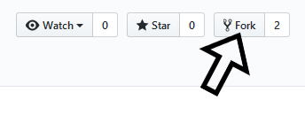
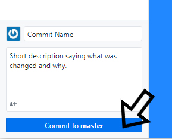
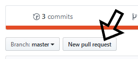

# CSU Data Science Club Website

Website for the Data Science Club at Colorado State University.

## How to Contribute

### Contribution Guidelines

* Be respectful, try to build and improve the website and where possible avoid deleting code
* To avoid code formatting issues please follow Google's Standards
  * [HTML/CSS Style Guide](https://google.github.io/styleguide/htmlcssguide.html)
  * [JavaScript Style Guide](https://google.github.io/styleguide/javascriptguide.xml)
  * The main thing is to make sure your indent is set to 2 so if you auto format code it doesn't add or remove tons of spaces. But give the guides a quick look because it'll form good habits that will benefit you in industry.

### GitHub 101

#### Step 1 Fork Repo

Be logged into your own GitHub account and navigate to [https://github.com/csudsc/csudsc.github.io/](https://github.com/csudsc/csudsc.github.io/). Chances are you're already there so great job.

Then fork the repo using the fork button in the top right of this page.

You'll now have your own version of the repo on your account.

#### Step 2 Clone Repo

If you're unfamiliar with GitHub or Git you should probably get started using [Github Desktop](https://desktop.github.com/), which is a user friendly gui. So go download that if it's not already on your computer. Sign in to your GitHub account on GitHub Desktop. You'll now be able to clone the repository on to your machine.

#### Step 3 Make Changes

Now you'll have all the files on your machine and you can make some changes.

#### Step 4 Commit Changes

After your done with your changes go back to GitHub Desktop and create a commit with your changes.

Make sure you hit the sync button in GitHub Desktop.

#### Step 5 Make Pull Request

Hit the New Pull Request button on your fork of the repo. If your confused about how to get to that page it's github.com/yourusername/csudsc.github.io/.

You be able to see what changes you've made and make sure they look good. Then give a short description of your Pull Request. Say what you've change, and why you changed it.

#### Step 6 Wait

Wait for someone to approve your pull request. You maybe asked to changed something before the request is accepted or it maybe denied. But with this project it's unlikely there will be any complaints.